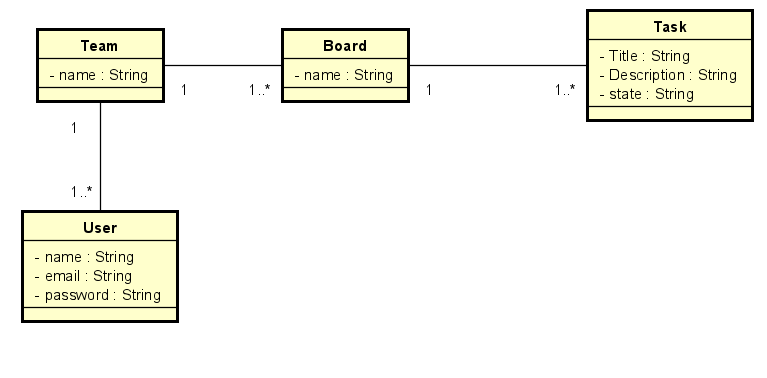

Juan Sebastian Velandia
# FlowBoard

FlowBoard es una plataforma web de colaboración ágil en tiempo real, diseñada para múltiples equipos que trabajan simultáneamente en contextos independientes. Permite organizar tareas utilizando metodologías ágiles como Scrum o Kanban, coordinar reuniones diarias (Daily Stand-Ups), editar tarjetas en tiempo real y facilitar la comunicación directa mediante chats por tarea.

## Características principales

- **Gestión de tareas:** Organización de tareas en tableros Kanban/Scrum.
- **Colaboración en tiempo real:** Edición simultánea de tarjetas y tareas.
- **Reuniones diarias:** Herramientas para coordinar y registrar Daily Stand-Ups.
- **Chats por tarea:** Comunicación directa y contextualizada para cada tarea.
- **Multi-equipo:** Soporte para que varios equipos trabajen de manera independiente y simultánea.
- **Enfoque académico y comunitario:** Ideal para grupos de estudio, hackatones y comunidades de práctica, permitiendo la colaboración de más de 10 usuarios sin la complejidad de plataformas corporativas.

## Diagrama de clases


## Tecnologías utilizadas

- **Backend:** Spring Boot, MongoDB
- **Frontend:** React
- **Seguridad:** Spring Security
- **Comunicación en tiempo real:** (Por definir/agregar si aplica, ej. WebSocket)

## Instalación y ejecución

1. Clona el repositorio:
   ```sh
   git clone https://github.com/tu-usuario/FlowBoard.git
   ```
2. Configura la base de datos MongoDB en `src/main/resources/application.properties`.
3. Ejecuta el backend:
   ```sh
   ./mvnw spring-boot:run
   ```
4. (Opcional) Ejecuta el frontend si aplica.

## Contribución

¡Las contribuciones son bienvenidas! Por favor, abre un issue o un pull request para sugerencias y mejoras.

## Licencia

Este proyecto está bajo la licencia Apache 2.0.

---

FlowBoard: colaboración ágil, simple y en tiempo real para equipos académicos y comunidades.