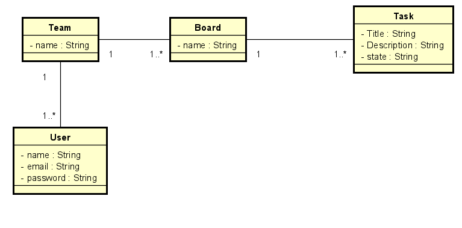

# FlowBoard

> **Plataforma web de gestión ágil de proyectos con colaboración en tiempo real.**

FlowBoard es un backend concurrente construido con **Spring Boot** que expone una API REST y canales WebSocket para soportar la gestión de tareas al estilo Kanban/Scrum. Está diseñado para equipos que necesitan colaborar simultáneamente: los cambios en tableros y tareas se propagan al instante a todos los participantes conectados.

**Caso de uso principal:** Equipos de desarrollo de software, grupos de estudio, hackatones y comunidades de práctica que requieren coordinar sprints, asignar tareas y chatear en contexto sin depender de herramientas corporativas complejas.

**Público objetivo:** Desarrolladores backend/fullstack, equipos ágiles y cualquier organización que busque una solución liviana y extensible para la gestión de proyectos colaborativos.

---

## Tabla de contenidos

1. [Funcionalidades principales](#funcionalidades-principales)
2. [Arquitectura y stack tecnológico](#arquitectura-y-stack-tecnológico)
3. [Diagrama de clases](#diagrama-de-clases)
4. [Instalación y ejecución local](#instalación-y-ejecución-local)
5. [Variables de entorno](#variables-de-entorno)
6. [API REST — Endpoints](#api-rest--endpoints)
   - [Autenticación y usuarios](#autenticación-y-usuarios)
   - [Equipos](#equipos)
   - [Tableros](#tableros)
   - [Sprints](#sprints)
   - [Tareas](#tareas)
   - [Mensajes](#mensajes)
7. [WebSocket API](#websocket-api)
8. [Scripts útiles](#scripts-útiles)
9. [Pruebas](#pruebas)
10. [Despliegue](#despliegue)
11. [CI/CD](#cicd)
12. [Contribución](#contribución)
13. [Licencia](#licencia)

---

## Funcionalidades principales

| Funcionalidad | Descripción |
|---|---|
| **Gestión de equipos** | Crear equipos, invitar miembros por correo y aceptar invitaciones pendientes. |
| **Tableros Kanban/Scrum** | Cada equipo dispone de un tablero con columnas `TO-DO`, `DOING` y `DONE`. |
| **Sprints** | Crear y gestionar sprints asociados a un tablero con fechas de inicio/fin y objetivo. |
| **Gestión de tareas** | CRUD completo de tareas con cambio de estado en tiempo real. |
| **Chat por tarea** | Mensajería contextualizada: cada tarea tiene su propio hilo de mensajes. |
| **Colaboración en tiempo real** | Actualizaciones de tareas y chats transmitidas vía WebSocket (STOMP/SockJS). |
| **Autenticación con JWT** | Registro, inicio de sesión y protección de endpoints con tokens JWT. |

---

## Arquitectura y stack tecnológico

```
┌──────────────────────┐        REST / WebSocket         ┌───────────────────────┐
│   Frontend (React)   │ ◄─────────────────────────────► │  Backend (Spring Boot) │
│  Azure Static Web    │                                  │    Java 17 / Maven     │
└──────────────────────┘                                  └──────────┬────────────┘
                                                                     │
                                                          ┌──────────▼────────────┐
                                                          │    MongoDB Atlas       │
                                                          └───────────────────────┘
```

| Capa | Tecnología |
|---|---|
| **Lenguaje** | Java 17 |
| **Framework** | Spring Boot 3.5.3 |
| **Base de datos** | MongoDB (Spring Data MongoDB) |
| **Seguridad** | Spring Security + JWT (`jjwt 0.11.5`) |
| **Tiempo real** | WebSocket con STOMP y SockJS |
| **Utilidades** | Lombok, Spring Boot DevTools |
| **Build** | Apache Maven (Maven Wrapper incluido) |
| **Frontend** | React (repositorio independiente) |
| **Despliegue** | Azure App Service / Azure Static Web Apps |

### Requisitos no funcionales prioritarios

| NFR | Cómo el diseño lo aborda |
|---|---|
| **Seguridad** | Autenticación y autorización con Spring Security + JWT; secretos gestionados exclusivamente mediante variables de entorno y GitHub Secrets (nunca en el código fuente); CORS configurado para orígenes controlados; HTTPS en Azure App Service. |
| **Alta disponibilidad** | Despliegue en Azure App Service con soporte de escalado administrado; MongoDB Atlas con replicación integrada y `retryWrites=true`; pipeline CI/CD automatizado que garantiza despliegues consistentes y repetibles al slot de producción sin intervención manual. |

---

## Diagrama de clases



---

## Instalación y ejecución local

### Prerrequisitos

- Java 17 o superior
- Maven 3.8+ (o usar el wrapper incluido `./mvnw`)
- Instancia de MongoDB accesible (local o MongoDB Atlas)

### Pasos

1. **Clonar el repositorio:**

   ```bash
   git clone https://github.com/Juanvelandia-p/FlowBoard.git
   cd FlowBoard
   ```

2. **Configurar la variable de entorno** (ver sección [Variables de entorno](#variables-de-entorno)):

   ```bash
   export MONGODB_URI="mongodb+srv://<usuario>:<contraseña>@<cluster>.mongodb.net/<db>?retryWrites=true&w=majority"
   ```

3. **Compilar y ejecutar el backend:**

   ```bash
   ./mvnw spring-boot:run
   ```

   La API quedará disponible en `http://localhost:8080`.

4. **Verificar que la aplicación está corriendo:**

   ```bash
   curl http://localhost:8080/api/teams
   ```

---

## Variables de entorno

| Variable | Descripción | Requerida |
|---|---|---|
| `MONGODB_URI` | URI de conexión a MongoDB (incluyendo credenciales y nombre de la base de datos) | ✅ Sí |

> **Nota de seguridad:** Nunca incluyas credenciales reales en el código fuente ni en el control de versiones. Usa variables de entorno, un archivo `.env` (excluido del repositorio) o un gestor de secretos.

Ejemplo de archivo `.env` local (no commitear):

```env
MONGODB_URI=mongodb://localhost:27017/flowboard
```

---

## API REST — Endpoints

Todos los endpoints protegidos requieren el header:

```
Authorization: Bearer <jwt_token>
```

El token se obtiene en el endpoint de login.

---

### Autenticación y usuarios

#### `POST /api/users/register` — Registrar usuario

**Request:**
```json
{
  "username": "juandev",
  "email": "juan@example.com",
  "password": "securePassword123"
}
```

**Response `200 OK`:**
```
User registered successfully
```

---

#### `POST /api/auth/login` — Iniciar sesión

**Request:**
```json
{
  "email": "juan@example.com",
  "password": "securePassword123"
}
```

**Response `200 OK`:**
```json
{
  "token": "eyJhbGciOiJIUzI1NiIsInR5cCI6IkpXVCJ9..."
}
```

**Response `401 Unauthorized`:**
```
Credenciales inválidas
```

---

#### `POST /api/users/userID` — Obtener ID de usuario por email

> Requiere autenticación.

**Request body:** `"juan@example.com"`

**Response `200 OK`:** `"64b1f...abc123"`

---

### Equipos

#### `POST /api/teams` — Crear equipo

> Requiere autenticación. El líder es el usuario autenticado.

**Request:**
```json
{
  "name": "Equipo Alpha",
  "invitedEmails": ["colaborador@example.com"]
}
```

**Response `200 OK`:**
```json
{
  "id": "64b1f...",
  "name": "Equipo Alpha",
  "leaderId": "64a0e...",
  "memberIds": ["64a0e..."],
  "pendingInvitations": ["colaborador@example.com"]
}
```

> Al crear un equipo se crea automáticamente un tablero asociado con el nombre `"<nombre> Board"`.

---

#### `GET /api/teams/my` — Equipos del usuario autenticado

> Requiere autenticación.

**Response `200 OK`:** Lista de equipos donde el usuario es miembro.

---

#### `GET /api/teams/pending-invitations` — Invitaciones pendientes

> Requiere autenticación.

**Response `200 OK`:** Lista de equipos que tienen al usuario autenticado en `pendingInvitations`.

---

#### `POST /api/teams/{teamId}/accept-invitation` — Aceptar invitación

> Requiere autenticación.

**Response `200 OK`:** `"Invitación aceptada"`

---

#### `GET /api/teams` — Listar todos los equipos

**Response `200 OK`:** Array de equipos.

---

#### `GET /api/teams/{id}` — Obtener equipo por ID

**Response `200 OK`:** Objeto `Team`. `404` si no existe.

---

#### `PUT /api/teams` — Actualizar equipo

**Request:** Objeto `Team` completo con `id`.

---

#### `DELETE /api/teams/{id}` — Eliminar equipo

**Response `204 No Content`**

---

### Tableros

#### `POST /api/boards` — Crear tablero

**Request:**
```json
{
  "name": "Mi Tablero",
  "teamId": "64b1f..."
}
```

**Response `200 OK`:** Objeto `Board` creado.

---

#### `GET /api/boards/team/{teamId}` — Tableros de un equipo

**Response `200 OK`:** Lista de tableros del equipo.

---

#### `GET /api/boards/{id}` — Obtener tablero por ID

**Response `200 OK`:** Objeto `Board`. `404` si no existe.

---

#### `PUT /api/boards` — Actualizar tablero

**Request:** Objeto `Board` completo con `id`.

---

#### `DELETE /api/boards/{id}` — Eliminar tablero

**Response `204 No Content`**

---

### Sprints

#### `POST /api/sprints` — Crear sprint

> Al crear un sprint, se notifica en tiempo real al canal `/topic/board-sprints.{boardId}`.

**Request:**
```json
{
  "boardId": "64b1f...",
  "nombre": "Sprint 1",
  "fechaInicio": "2025-01-01",
  "fechaFin": "2025-01-14",
  "objetivo": "Implementar módulo de autenticación"
}
```

**Response `200 OK`:** Objeto `Sprint` creado.

---

#### `GET /api/sprints/board/{boardId}` — Sprints de un tablero

**Response `200 OK`:** Lista de sprints asociados al tablero.

---

#### `GET /api/sprints/{sprintId}/tasks` — Tareas de un sprint

**Response `200 OK`:** Lista de tareas del sprint.

---

#### `GET /api/sprints/{id}` — Obtener sprint por ID

**Response `200 OK`:** Objeto `Sprint`. `404` si no existe.

---

#### `PUT /api/sprints` — Actualizar sprint

**Request:** Objeto `Sprint` completo con `id`.

---

#### `DELETE /api/sprints/{id}` — Eliminar sprint

**Response `204 No Content`**

---

### Tareas

#### `POST /api/tasks` — Crear tarea

> Al crear una tarea, se notifica en tiempo real al canal `/topic/sprint-tasks.{sprintId}`.

**Request:**
```json
{
  "titulo": "Implementar login",
  "descripcion": "Crear endpoint POST /api/auth/login con JWT",
  "estado": "TO-DO",
  "boardId": "64b1f...",
  "sprintId": "64c2g..."
}
```

**Response `200 OK`:** Objeto `Task` creado.

---

#### `GET /api/tasks/board/{boardId}` — Tareas de un tablero

**Response `200 OK`:** Lista de tareas del tablero.

---

#### `GET /api/tasks/sprint/{sprintId}` — Tareas de un sprint

**Response `200 OK`:** Lista de tareas del sprint.

---

#### `GET /api/tasks/estado/{estado}` — Tareas por estado

Estados válidos: `TO-DO`, `DOING`, `DONE`

**Response `200 OK`:** Lista de tareas con el estado indicado.

---

#### `GET /api/tasks/{id}` — Obtener tarea por ID

**Response `200 OK`:** Objeto `Task`. `404` si no existe.

---

#### `PUT /api/tasks` — Actualizar tarea

**Request:** Objeto `Task` completo con `id`.

---

#### `PUT /api/tasks/{id}/estado` — Cambiar estado de una tarea

**Request body:** `"DOING"`

**Response `200 OK`:** Objeto `Task` actualizado.

---

#### `DELETE /api/tasks/{id}` — Eliminar tarea

**Response `204 No Content`**

---

### Mensajes

#### `POST /api/messages` — Crear mensaje

**Request:**
```json
{
  "taskId": "64d3h...",
  "userId": "64a0e...",
  "content": "Este endpoint está listo para revisión."
}
```

**Response `200 OK`:** Objeto `Message` creado (con `timestamp` generado por el servidor).

---

#### `GET /api/messages/task/{taskId}` — Mensajes de una tarea

> Requiere autenticación.

**Response `200 OK`:** Lista de mensajes de la tarea. `404` si no hay mensajes.

---

#### `GET /api/messages/{id}` — Obtener mensaje por ID

**Response `200 OK`:** Objeto `Message`. `404` si no existe.

---

#### `DELETE /api/messages/{id}` — Eliminar mensaje

**Response `204 No Content`**

---

## WebSocket API

FlowBoard usa **STOMP sobre SockJS**. El endpoint de conexión es `/ws`.

### Conectar

```javascript
const socket = new SockJS('http://localhost:8080/ws');
const stompClient = Stomp.over(socket);
stompClient.connect({}, () => { /* conectado */ });
```

### Canales disponibles

| Tipo | Destino | Descripción |
|---|---|---|
| **Envío** (cliente → servidor) | `/app/task/chat` | Enviar un mensaje de chat en una tarea |
| **Envío** (cliente → servidor) | `/app/task/drag` | Notificar arrastre de una tarea entre columnas |
| **Suscripción** (servidor → cliente) | `/topic/task-chat.{taskId}` | Recibir mensajes de chat de una tarea específica |
| **Suscripción** (servidor → cliente) | `/topic/task-drag.{boardId}` | Recibir eventos de arrastre en un tablero |
| **Suscripción** (servidor → cliente) | `/topic/sprint-tasks.{sprintId}` | Recibir nuevas tareas creadas en un sprint |
| **Suscripción** (servidor → cliente) | `/topic/board-sprints.{boardId}` | Recibir nuevos sprints creados en un tablero |

### Ejemplo — Chat por tarea

```javascript
// Suscribirse al chat de la tarea
stompClient.subscribe('/topic/task-chat.64d3h...', (msg) => {
  console.log(JSON.parse(msg.body));
});

// Enviar un mensaje
stompClient.send('/app/task/chat', {}, JSON.stringify({
  taskId: '64d3h...',
  userId: '64a0e...',
  content: 'Revisando este componente ahora.'
}));
```

### Ejemplo — Drag & Drop en tiempo real

```javascript
stompClient.subscribe('/topic/task-drag.64b1f...', (event) => {
  const { taskId, fromStatus, toStatus } = JSON.parse(event.body);
  // Actualizar UI localmente
});

stompClient.send('/app/task/drag', {}, JSON.stringify({
  taskId: '64d3h...',
  fromStatus: 'TO-DO',
  toStatus: 'DOING',
  boardId: '64b1f...',
  userId: '64a0e...'
}));
```

---

## Scripts útiles

| Comando | Descripción |
|---|---|
| `./mvnw spring-boot:run` | Iniciar la aplicación en modo desarrollo |
| `./mvnw clean package` | Compilar y empaquetar el proyecto en un JAR |
| `./mvnw test` | Ejecutar la suite de pruebas |
| `./mvnw clean package -DskipTests` | Empaquetar sin ejecutar pruebas |
| `java -jar target/FlowBoard-0.0.1-SNAPSHOT.jar` | Ejecutar el JAR empaquetado |

---

## Pruebas

El proyecto incluye pruebas de integración basadas en **Spring Boot Test** y **Spring Security Test**.

```bash
./mvnw test
```

Las pruebas se encuentran en `src/test/java/escuelaing/edu/arsw/FlowBoard/`.

---

## Despliegue

### Azure (configuración actual)

El backend está configurado para aceptar conexiones WebSocket desde los siguientes orígenes:

- `https://happy-bush-0e0054b0f.2.azurestaticapps.net` (frontend en Azure Static Web Apps)
- `http://localhost:3000` (entorno local)

Para desplegar el backend en Azure App Service:

1. Empaquetar la aplicación:
   ```bash
   ./mvnw clean package -DskipTests
   ```

2. Configurar la variable de entorno `MONGODB_URI` en la configuración de la aplicación de Azure.

3. Subir el JAR generado en `target/FlowBoard-0.0.1-SNAPSHOT.jar` a Azure App Service.

Para añadir nuevos orígenes permitidos, editar `src/main/java/escuelaing/edu/arsw/FlowBoard/config/WebSocketConfig.java`.

---

## CI/CD

FlowBoard utiliza **GitHub Actions** para automatizar la integración y el despliegue continuo. El pipeline está definido en `.github/workflows/main_flowboard.yml`.

### Disparadores (Triggers)

| Evento | Rama | Descripción |
|---|---|---|
| `push` | `main` | Ejecuta el pipeline automáticamente al integrar cambios en la rama principal |
| `workflow_dispatch` | cualquiera | Permite disparar el pipeline manualmente desde la interfaz de GitHub |

### Etapas del pipeline

El pipeline se compone de dos jobs secuenciales: `build` → `deploy`.

#### 1. `build` — Compilación y empaquetado

| Paso | Acción / Comando | Descripción |
|---|---|---|
| Checkout | `actions/checkout@v4` | Clona el código fuente del repositorio |
| Configurar Java | `actions/setup-java@v4` | Configura Java 17 (distribución Microsoft) |
| Compilar y probar | `mvn clean install` | Compila el proyecto, ejecuta la suite de pruebas y genera el JAR |
| Subir artefacto | `actions/upload-artifact@v4` | Publica el JAR (`target/*.jar`) para el job de despliegue |

> **Gestión de secretos:** La variable `MONGODB_URI` se inyecta como GitHub Secret durante el build (`secrets.MONGODB_URI`), evitando exponer credenciales en el código fuente.

#### 2. `deploy` — Despliegue en Azure

| Paso | Acción | Descripción |
|---|---|---|
| Descargar artefacto | `actions/download-artifact@v4` | Recupera el JAR generado en la etapa anterior |
| Autenticar en Azure | `azure/login@v2` | Autentica mediante OIDC (Workload Identity Federation) usando secretos de servicio almacenados en GitHub |
| Desplegar | `azure/webapps-deploy@v3` | Despliega el JAR al slot `Production` del Azure App Service `Flowboard` |

La autenticación con Azure utiliza credenciales federadas (client ID, tenant ID y subscription ID) almacenadas como GitHub Secrets, sin claves de larga duración ni contraseñas en el repositorio.

### Estrategia de ramas y promoción de ambientes

- La rama **`main`** es la rama de producción. Todo push a `main` desencadena automáticamente un nuevo despliegue al entorno de producción en Azure.
- Se recomienda trabajar en ramas de feature (`feature/<nombre>`) y abrir un **Pull Request** hacia `main` para revisión antes de integrar (ver sección [Contribución](#contribución)).

---

## Contribución

¡Las contribuciones son bienvenidas! Por favor, sigue estos pasos:

1. Haz un **fork** del repositorio.
2. Crea una rama descriptiva para tu feature o corrección:
   ```bash
   git checkout -b feature/nueva-funcionalidad
   ```
3. Realiza tus cambios con commits claros y descriptivos.
4. Asegúrate de que las pruebas existentes siguen pasando:
   ```bash
   ./mvnw test
   ```
5. Abre un **Pull Request** describiendo los cambios realizados.

### Guías de estilo

- Seguir las convenciones de nombres de Java (camelCase para variables y métodos, PascalCase para clases).
- Documentar los nuevos endpoints en este README.
- No incluir secretos, credenciales ni datos sensibles en el código fuente.

---

## Licencia

Este proyecto está distribuido bajo la licencia **Apache 2.0**.

---

*FlowBoard — colaboración ágil, simple y en tiempo real.*
