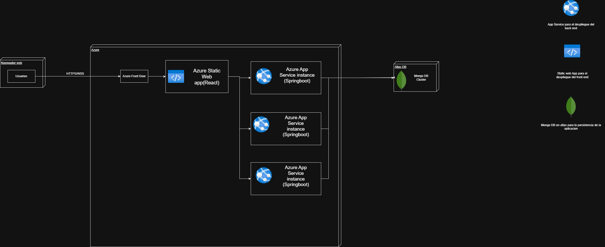
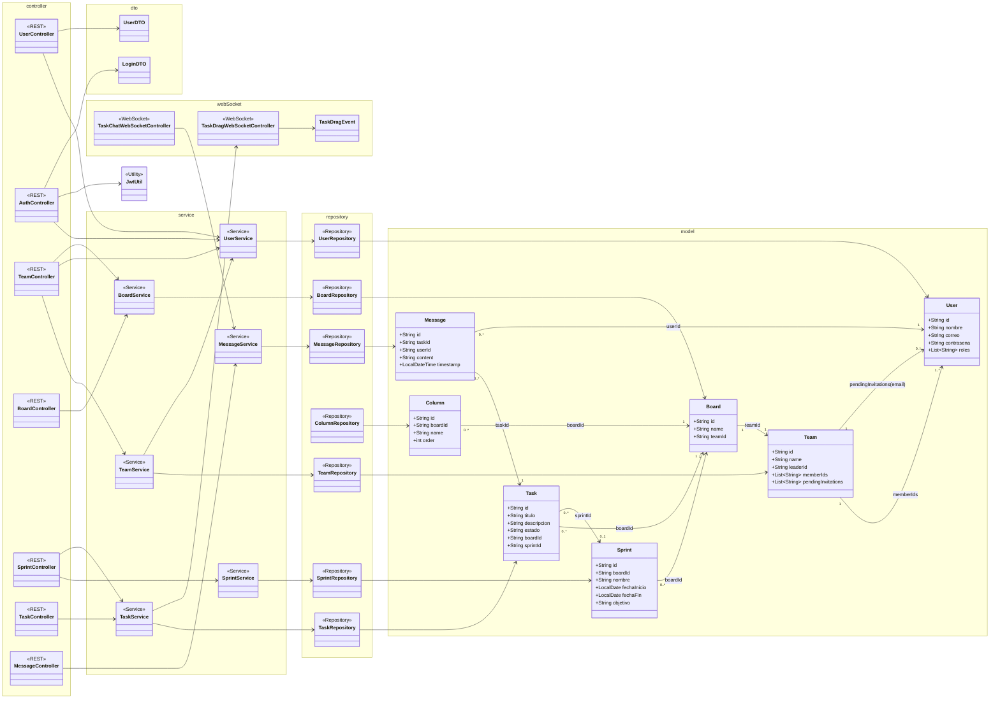

# FlowBoard

> **Agile project management web platform with real-time collaboration.**

FlowBoard is a concurrent backend built with **Spring Boot** that exposes a REST API and WebSocket channels to support Kanban/Scrum-style task management. It is designed for teams that need to collaborate simultaneously: changes to boards and tasks are instantly propagated to all connected participants.

**Primary use case:** Software development teams, study groups, hackathons, and communities of practice that need to coordinate sprints, assign tasks, and chat in context without relying on complex corporate tooling.

**Target audience:** Backend/fullstack developers, agile teams, and any organization looking for a lightweight and extensible solution for collaborative project management.

---

## Table of Contents

1. [Key Features](#key-features)
2. [Architecture & Tech Stack](#architecture--tech-stack)
3. [Class Diagram](#class-diagram)
4. [Local Installation & Setup](#local-installation--setup)
5. [Environment Variables](#environment-variables)
6. [REST API — Endpoints](#rest-api--endpoints)
   - [Authentication & Users](#authentication--users)
   - [Teams](#teams)
   - [Boards](#boards)
   - [Sprints](#sprints)
   - [Tasks](#tasks)
   - [Messages](#messages)
7. [WebSocket API](#websocket-api)
8. [Useful Scripts](#useful-scripts)
9. [Testing](#testing)
10. [Deployment](#deployment)
11. [CI/CD](#cicd)
12. [Contributing](#contributing)
13. [License](#license)

---

## Key Features

| Feature | Description |
|---|---|
| **Team management** | Create teams, invite members by email, and accept pending invitations. |
| **Kanban/Scrum boards** | Each team has a board with `TO-DO`, `DOING`, and `DONE` columns. |
| **Sprints** | Create and manage sprints linked to a board with start/end dates and a goal. |
| **Task management** | Full CRUD for tasks with real-time status updates. |
| **Per-task chat** | Contextual messaging: each task has its own message thread. |
| **Real-time collaboration** | Task updates and chats broadcast via WebSocket (STOMP/SockJS). |
| **JWT authentication** | Registration, login, and endpoint protection with JWT tokens. |

---

## Architecture & Tech Stack



| Layer | Technology |
|---|---|
| **Language** | Java 17 |
| **Framework** | Spring Boot 3.5.3 |
| **Database** | MongoDB (Spring Data MongoDB) |
| **Security** | Spring Security + JWT (`jjwt 0.11.5`) |
| **Real-time** | WebSocket with STOMP and SockJS |
| **Utilities** | Lombok, Spring Boot DevTools |
| **Build** | Apache Maven (Maven Wrapper included) |
| **Frontend** | React (independent repository) |
| **Deployment** | Azure App Service / Azure Static Web Apps |

### Priority Non-Functional Requirements

| NFR | How the design addresses it |
|---|---|
| **Security** | Authentication and authorization via Spring Security + JWT; secrets managed exclusively through environment variables and GitHub Secrets (never in source code); CORS restricted to controlled origins; HTTPS enforced on Azure App Service. |
| **High Availability** | Deployment on Azure App Service with managed scaling support; MongoDB Atlas with built-in replication and `retryWrites=true`; automated CI/CD pipeline that ensures consistent and repeatable deployments to the production slot without manual intervention. |

---

## Class Diagram


```mermaid
classDiagram
direction LR

namespace model {
  class User {
    +String id
    +String nombre
    +String correo
    +String contrasena
    +List~String~ roles
  }

  class Team {
    +String id
    +String name
    +String leaderId
    +List~String~ memberIds
    +List~String~ pendingInvitations
  }

  class Board {
    +String id
    +String name
    +String teamId
  }

  class Column {
    +String id
    +String boardId
    +String name
    +int order
  }

  class Sprint {
    +String id
    +String boardId
    +String nombre
    +LocalDate fechaInicio
    +LocalDate fechaFin
    +String objetivo
  }

  class Task {
    +String id
    +String titulo
    +String descripcion
    +String estado
    +String boardId
    +String sprintId
  }

  class Message {
    +String id
    +String taskId
    +String userId
    +String content
    +LocalDateTime timestamp
  }
}

namespace repository {
  class UserRepository <<Repository>>
  class TeamRepository <<Repository>>
  class BoardRepository <<Repository>>
  class ColumnRepository <<Repository>>
  class SprintRepository <<Repository>>
  class TaskRepository <<Repository>>
  class MessageRepository <<Repository>>
}

namespace service {
  class UserService <<Service>>
  class TeamService <<Service>>
  class BoardService <<Service>>
  class SprintService <<Service>>
  class TaskService <<Service>>
  class MessageService <<Service>>
}

namespace controller {
  class UserController <<REST>>
  class AuthController <<REST>>
  class TeamController <<REST>>
  class BoardController <<REST>>
  class SprintController <<REST>>
  class TaskController <<REST>>
  class MessageController <<REST>>
}

namespace webSocket {
  class TaskChatWebSocketController <<WebSocket>>
  class TaskDragWebSocketController <<WebSocket>>
  class TaskDragEvent
}

namespace dto {
  class UserDTO
  class LoginDTO
}

class JwtUtil <<Utility>>

Team "1" --> "1..*" User : memberIds
Team "1" --> "0..*" User : pendingInvitations(email)
Board "1" --> "1" Team : teamId
Column "0..*" --> "1" Board : boardId
Sprint "0..*" --> "1" Board : boardId
Task "0..*" --> "1" Board : boardId
Task "0..*" --> "0..1" Sprint : sprintId
Message "0..*" --> "1" Task : taskId
Message "0..*" --> "1" User : userId

UserRepository --> User
TeamRepository --> Team
BoardRepository --> Board
ColumnRepository --> Column
SprintRepository --> Sprint
TaskRepository --> Task
MessageRepository --> Message

UserService --> UserRepository
TeamService --> TeamRepository
TeamService --> UserService
BoardService --> BoardRepository
SprintService --> SprintRepository
TaskService --> TaskRepository
TaskService --> TaskDragWebSocketController
MessageService --> MessageRepository

UserController --> UserService
AuthController --> UserService
AuthController --> JwtUtil
TeamController --> TeamService
TeamController --> UserService
TeamController --> BoardService
BoardController --> BoardService
SprintController --> SprintService
SprintController --> TaskService
TaskController --> TaskService
MessageController --> MessageService

TaskChatWebSocketController --> MessageService
TaskDragWebSocketController --> TaskDragEvent
AuthController --> LoginDTO
UserController --> UserDTO
```

---

## Local Installation & Setup

### Prerequisites

- Java 17 or higher
- Maven 3.8+ (or use the included wrapper `./mvnw`)
- An accessible MongoDB instance (local or MongoDB Atlas)

### Steps

1. **Clone the repository:**

   ```bash
   git clone https://github.com/Juanvelandia-p/FlowBoard.git
   cd FlowBoard
   ```

2. **Set the environment variable** (see [Environment Variables](#environment-variables)):

   ```bash
   export MONGODB_URI="mongodb+srv://<user>:<password>@<cluster>.mongodb.net/<db>?retryWrites=true&w=majority"
   ```

3. **Build and run the backend:**

   ```bash
   ./mvnw spring-boot:run
   ```

   The API will be available at `http://localhost:8080`.

4. **Verify the application is running:**

   ```bash
   curl http://localhost:8080/api/teams
   ```

---

## Environment Variables

| Variable | Description | Required |
|---|---|---|
| `MONGODB_URI` | MongoDB connection URI (including credentials and database name) | ✅ Yes |

> **Security note:** Never include real credentials in source code or version control. Use environment variables, a `.env` file (excluded from the repository), or a secrets manager.

Example local `.env` file (do not commit):

```env
MONGODB_URI=mongodb://localhost:27017/flowboard
```

---

## REST API — Endpoints

All protected endpoints require the following header:

```
Authorization: Bearer <jwt_token>
```

The token is obtained from the login endpoint.

---

### Authentication & Users

#### `POST /api/users/register` — Register a user

**Request:**
```json
{
  "username": "juandev",
  "email": "juan@example.com",
  "password": "securePassword123"
}
```

**Response `200 OK`:**
```
User registered successfully
```

---

#### `POST /api/auth/login` — Log in

**Request:**
```json
{
  "email": "juan@example.com",
  "password": "securePassword123"
}
```

**Response `200 OK`:**
```json
{
  "token": "eyJhbGciOiJIUzI1NiIsInR5cCI6IkpXVCJ9..."
}
```

**Response `401 Unauthorized`:**
```
Invalid credentials
```

---

#### `POST /api/users/userID` — Get user ID by email

> Requires authentication.

**Request body:** `"juan@example.com"`

**Response `200 OK`:** `"64b1f...abc123"`

---

### Teams

#### `POST /api/teams` — Create a team

> Requires authentication. The authenticated user becomes the team leader.

**Request:**
```json
{
  "name": "Team Alpha",
  "invitedEmails": ["collaborator@example.com"]
}
```

**Response `200 OK`:**
```json
{
  "id": "64b1f...",
  "name": "Team Alpha",
  "leaderId": "64a0e...",
  "memberIds": ["64a0e..."],
  "pendingInvitations": ["collaborator@example.com"]
}
```

> When a team is created, an associated board named `"<team name> Board"` is automatically created.

---

#### `GET /api/teams/my` — Teams of the authenticated user

> Requires authentication.

**Response `200 OK`:** List of teams where the user is a member.

---

#### `GET /api/teams/pending-invitations` — Pending invitations

> Requires authentication.

**Response `200 OK`:** List of teams that have the authenticated user in `pendingInvitations`.

---

#### `POST /api/teams/{teamId}/accept-invitation` — Accept an invitation

> Requires authentication.

**Response `200 OK`:** `"Invitation accepted"`

---

#### `GET /api/teams` — List all teams

**Response `200 OK`:** Array of teams.

---

#### `GET /api/teams/{id}` — Get team by ID

**Response `200 OK`:** `Team` object. `404` if not found.

---

#### `PUT /api/teams` — Update a team

**Request:** Full `Team` object including `id`.

---

#### `DELETE /api/teams/{id}` — Delete a team

**Response `204 No Content`**

---

### Boards

#### `POST /api/boards` — Create a board

**Request:**
```json
{
  "name": "My Board",
  "teamId": "64b1f..."
}
```

**Response `200 OK`:** Created `Board` object.

---

#### `GET /api/boards/team/{teamId}` — Boards for a team

**Response `200 OK`:** List of boards for the team.

---

#### `GET /api/boards/{id}` — Get board by ID

**Response `200 OK`:** `Board` object. `404` if not found.

---

#### `PUT /api/boards` — Update a board

**Request:** Full `Board` object including `id`.

---

#### `DELETE /api/boards/{id}` — Delete a board

**Response `204 No Content`**

---

### Sprints

#### `POST /api/sprints` — Create a sprint

> When a sprint is created, a real-time notification is sent to the `/topic/board-sprints.{boardId}` channel.

**Request:**
```json
{
  "boardId": "64b1f...",
  "nombre": "Sprint 1",
  "fechaInicio": "2025-01-01",
  "fechaFin": "2025-01-14",
  "objetivo": "Implement authentication module"
}
```

**Response `200 OK`:** Created `Sprint` object.

---

#### `GET /api/sprints/board/{boardId}` — Sprints for a board

**Response `200 OK`:** List of sprints associated with the board.

---

#### `GET /api/sprints/{sprintId}/tasks` — Tasks in a sprint

**Response `200 OK`:** List of tasks in the sprint.

---

#### `GET /api/sprints/{id}` — Get sprint by ID

**Response `200 OK`:** `Sprint` object. `404` if not found.

---

#### `PUT /api/sprints` — Update a sprint

**Request:** Full `Sprint` object including `id`.

---

#### `DELETE /api/sprints/{id}` — Delete a sprint

**Response `204 No Content`**

---

### Tasks

#### `POST /api/tasks` — Create a task

> When a task is created, a real-time notification is sent to the `/topic/sprint-tasks.{sprintId}` channel.

**Request:**
```json
{
  "titulo": "Implement login",
  "descripcion": "Create POST /api/auth/login endpoint with JWT",
  "estado": "TO-DO",
  "boardId": "64b1f...",
  "sprintId": "64c2g..."
}
```

**Response `200 OK`:** Created `Task` object.

---

#### `GET /api/tasks/board/{boardId}` — Tasks for a board

**Response `200 OK`:** List of tasks on the board.

---

#### `GET /api/tasks/sprint/{sprintId}` — Tasks for a sprint

**Response `200 OK`:** List of tasks in the sprint.

---

#### `GET /api/tasks/estado/{estado}` — Tasks by status

Valid statuses: `TO-DO`, `DOING`, `DONE`

**Response `200 OK`:** List of tasks with the given status.

---

#### `GET /api/tasks/{id}` — Get task by ID

**Response `200 OK`:** `Task` object. `404` if not found.

---

#### `PUT /api/tasks` — Update a task

**Request:** Full `Task` object including `id`.

---

#### `PUT /api/tasks/{id}/estado` — Change task status

**Request body:** `"DOING"`

**Response `200 OK`:** Updated `Task` object.

---

#### `DELETE /api/tasks/{id}` — Delete a task

**Response `204 No Content`**

---

### Messages

#### `POST /api/messages` — Create a message

**Request:**
```json
{
  "taskId": "64d3h...",
  "userId": "64a0e...",
  "content": "This endpoint is ready for review."
}
```

**Response `200 OK`:** Created `Message` object (with server-generated `timestamp`).

---

#### `GET /api/messages/task/{taskId}` — Messages for a task

> Requires authentication.

**Response `200 OK`:** List of messages for the task. `404` if no messages exist.

---

#### `GET /api/messages/{id}` — Get message by ID

**Response `200 OK`:** `Message` object. `404` if not found.

---

#### `DELETE /api/messages/{id}` — Delete a message

**Response `204 No Content`**

---

## WebSocket API

FlowBoard uses **STOMP over SockJS**. The connection endpoint is `/ws`.

### Connect

```javascript
const socket = new SockJS('http://localhost:8080/ws');
const stompClient = Stomp.over(socket);
stompClient.connect({}, () => { /* connected */ });
```

### Available Channels

| Type | Destination | Description |
|---|---|---|
| **Send** (client → server) | `/app/task/chat` | Send a chat message on a task |
| **Send** (client → server) | `/app/task/drag` | Notify a task drag between columns |
| **Subscribe** (server → client) | `/topic/task-chat.{taskId}` | Receive chat messages for a specific task |
| **Subscribe** (server → client) | `/topic/task-drag.{boardId}` | Receive drag events on a board |
| **Subscribe** (server → client) | `/topic/sprint-tasks.{sprintId}` | Receive newly created tasks in a sprint |
| **Subscribe** (server → client) | `/topic/board-sprints.{boardId}` | Receive newly created sprints on a board |

### Example — Per-task Chat

```javascript
// Subscribe to the task chat
stompClient.subscribe('/topic/task-chat.64d3h...', (msg) => {
  console.log(JSON.parse(msg.body));
});

// Send a message
stompClient.send('/app/task/chat', {}, JSON.stringify({
  taskId: '64d3h...',
  userId: '64a0e...',
  content: 'Reviewing this component now.'
}));
```

### Example — Real-time Drag & Drop

```javascript
stompClient.subscribe('/topic/task-drag.64b1f...', (event) => {
  const { taskId, fromStatus, toStatus } = JSON.parse(event.body);
  // Update UI locally
});

stompClient.send('/app/task/drag', {}, JSON.stringify({
  taskId: '64d3h...',
  fromStatus: 'TO-DO',
  toStatus: 'DOING',
  boardId: '64b1f...',
  userId: '64a0e...'
}));
```

---

## Useful Scripts

| Command | Description |
|---|---|
| `./mvnw spring-boot:run` | Start the application in development mode |
| `./mvnw clean package` | Compile and package the project into a JAR |
| `./mvnw test` | Run the test suite |
| `./mvnw clean package -DskipTests` | Package without running tests |
| `java -jar target/FlowBoard-0.0.1-SNAPSHOT.jar` | Run the packaged JAR |

---

## Testing

The project includes integration tests based on **Spring Boot Test** and **Spring Security Test**.

```bash
./mvnw test
```

Tests are located in `src/test/java/escuelaing/edu/arsw/FlowBoard/`.

---

## Deployment

### Azure (current configuration)

The backend is configured to accept WebSocket connections from the following origins:

- `https://happy-bush-0e0054b0f.2.azurestaticapps.net` (frontend on Azure Static Web Apps)
- `http://localhost:3000` (local development)

To deploy the backend to Azure App Service:

1. Package the application:
   ```bash
   ./mvnw clean package -DskipTests
   ```

2. Set the `MONGODB_URI` environment variable in the Azure application configuration.

3. Upload the generated JAR at `target/FlowBoard-0.0.1-SNAPSHOT.jar` to Azure App Service.

To add new allowed origins, edit `src/main/java/escuelaing/edu/arsw/FlowBoard/config/WebSocketConfig.java`.

---

## CI/CD

FlowBoard uses **GitHub Actions** to automate continuous integration and deployment. The pipeline is defined in `.github/workflows/main_flowboard.yml`.

### Triggers

| Event | Branch | Description |
|---|---|---|
| `push` | `main` | Automatically runs the pipeline when changes are merged into the main branch |
| `workflow_dispatch` | any | Allows the pipeline to be triggered manually from the GitHub UI |

### Pipeline Stages

The pipeline consists of two sequential jobs: `build` → `deploy`.

#### 1. `build` — Compile & Package

| Step | Action / Command | Description |
|---|---|---|
| Checkout | `actions/checkout@v4` | Clones the repository source code |
| Set up Java | `actions/setup-java@v4` | Configures Java 17 (Microsoft distribution) |
| Build & test | `mvn clean install` | Compiles the project, runs the test suite, and generates the JAR |
| Upload artifact | `actions/upload-artifact@v4` | Publishes the JAR (`target/*.jar`) for the deploy job |

> **Secrets management:** The `MONGODB_URI` variable is injected as a GitHub Secret during the build (`secrets.MONGODB_URI`), keeping credentials out of source code.

#### 2. `deploy` — Deploy to Azure

| Step | Action | Description |
|---|---|---|
| Download artifact | `actions/download-artifact@v4` | Retrieves the JAR produced in the previous stage |
| Authenticate to Azure | `azure/login@v2` | Authenticates via OIDC (Workload Identity Federation) using service credentials stored as GitHub Secrets |
| Deploy | `azure/webapps-deploy@v3` | Deploys the JAR to the `Production` slot of the `Flowboard` Azure App Service |

Azure authentication uses federated credentials (client ID, tenant ID, and subscription ID) stored as GitHub Secrets — no long-lived keys or passwords in the repository.

### Branch Strategy & Environment Promotion

- The **`main`** branch is the production branch. Every push to `main` automatically triggers a new deployment to the Azure production environment.
- It is recommended to work on feature branches (`feature/<name>`) and open a **Pull Request** targeting `main` for review before merging (see [Contributing](#contributing)).

---

## Contributing

Contributions are welcome! Please follow these steps:

1. **Fork** the repository.
2. Create a descriptive branch for your feature or fix:
   ```bash
   git checkout -b feature/new-feature
   ```
3. Make your changes with clear and descriptive commits.
4. Ensure existing tests still pass:
   ```bash
   ./mvnw test
   ```
5. Open a **Pull Request** describing the changes made.

### Style Guidelines

- Follow Java naming conventions (camelCase for variables and methods, PascalCase for classes).
- Document new endpoints in this README.
- Do not include secrets, credentials, or sensitive data in source code.

---

## License

This project is distributed under the **Apache 2.0** license.

---

*FlowBoard — agile collaboration, simple and real-time.*
